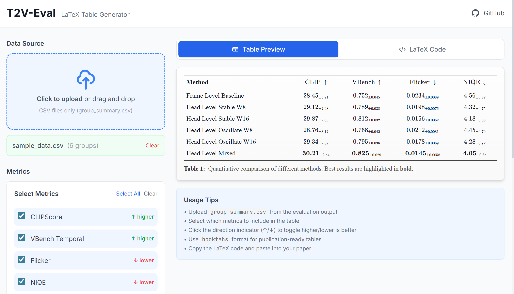
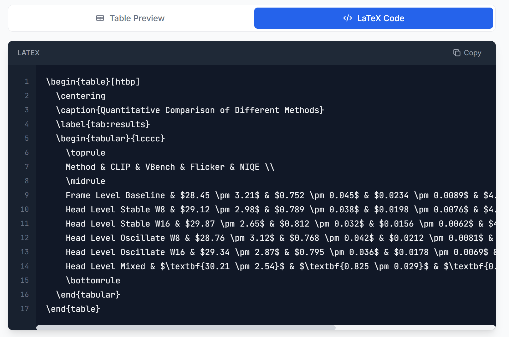

# T2V-Eval: 基于官方实现的文本生成视频评测框架

<p align="center">
  
</p>

<p align="center">
  <a href="README.md">English</a> | 中文文档
</p>

统一的、无参考视频的 **文本生成视频 (T2V)** 评测流水线，专注于对比不同推理策略的生成质量与效率。

> **核心特性**：本仓库通过 git submodule 集成 **VBench 和 t2v_metrics 官方实现**，确保评测结果的可复现性与学术可信度。

---

## 预览

### 前端 - LaTeX 表格生成器

<p align="center">
  
</p>

### LaTeX 输出效果

<p align="center">
  
</p>

---

## 功能特性

- **官方实现集成**：VBench 和 t2v_metrics 以 git submodule 方式集成
- **多维度评测**：CLIPScore、VQAScore、VBench 时序质量、Flicker、NIQE
- **一键运行**：单条命令完成所有评测
- **LaTeX 表格生成器**：前端工具生成论文级别的 LaTeX 表格
- **灵活配置**：基于 YAML 的实验配置

---

## 目录

- [官方实现说明](#官方实现说明)
- [快速开始](#快速开始)
- [评测指标](#评测指标)
- [项目结构](#项目结构)
- [详细使用指南](#详细使用指南)
- [评测协议](#评测协议)
- [可复现性](#可复现性)
- [常见问题](#常见问题)
- [论文引用](#论文引用)

---

## 官方实现说明

本评测框架以 git submodule 方式集成以下官方仓库：

| 仓库 | 用途 | 版本 (commit) |
|------|------|---------------|
| [VBench](https://github.com/Vchitect/VBench) | 时序质量评测 | `98b1951` |
| [t2v_metrics](https://github.com/linzhiqiu/t2v_metrics) | CLIPScore / VQAScore | `0bd9bfc` |

**为什么使用 submodule？**

- ✅ **可复现性**：通过锁定 commit hash 确保评测结果可复现
- ✅ **学术可信度**：使用经过同行评审的原始实现
- ✅ **版本控制**：可独立更新同时保持版本追溯
- ✅ **避免代码漂移**：不复制代码，避免与原仓库实现不一致

---

## 快速开始

### 1. 初始化子模块

```bash
git submodule update --init --recursive
```

### 2. 安装环境（uv）

```bash
uv venv --python 3.10
uv sync
source .venv/bin/activate
```

为保证 VBench-Long 16 维兼容性，环境已固定为：
- `torch==2.1.2`
- `torchvision==0.16.2`
- `timm<=1.0.12`

### 3. 运行评测

```bash
# VBench-Long（完整 16 维）
python scripts/run_vbench.py --config configs/Exp_OscStable_Head_Window_vbench16.yaml --force
```

### 4. 启动前端

```bash
cd frontend
pnpm install
pnpm exec vite --host 0.0.0.0 --port 5173 --strictPort
```

打开 `http://<your_host>:5173`。

---

## 详细使用指南

完整且持续更新的安装、依赖排障、数据准备、VBench 命令和前端同步说明，请以以下文档为准：

- `docs/USAGE.md`

---

## 评测指标

| 指标 | 输出列名 | 评测维度 | 方向 | 实现来源 |
|------|----------|----------|------|----------|
| **CLIPScore** | `clip_score` | 文本-视频一致性 | ↑ 越高越好 | 官方 t2v_metrics |
| **VQAScore** | `vqa_score` | 文本-视频一致性 | ↑ 越高越好 | 官方 t2v_metrics |
| **VBench-Long（16维）** | `subject_consistency` / `background_consistency` / `temporal_flickering` / `motion_smoothness` / `temporal_style` / `appearance_style` / `scene` / `object_class` / `multiple_objects` / `spatial_relationship` / `human_action` / `color` / `overall_consistency` / `dynamic_degree` / `imaging_quality` / `aesthetic_quality` | 长一致性与时序质量 | ↑ 越高越好 | 官方 VBench |
| **Temporal Flicker** | `flicker_mean` | 帧间稳定性 | ↓ 越低越好 | 本仓库实现 |
| **NIQE** | `niqe_mean` | 视觉质量 | ↓ 越低越好 | pyiqa |
| **#Frames / Duration** | `num_frames`, `duration_sec` | 生成规模 | — | 元数据 |

> **注意**：输出文件使用明确的列名（`clip_score` 或 `vqa_score`），根据 YAML 配置中的 mode 自动确定，避免歧义。

### 指标详解

#### CLIPScore / VQAScore（二选一）

通过配置文件选择模式：

```yaml
metrics:
  clip_or_vqa:
    mode: "clip"              # 或 "vqa"
    model_name: "ViT-B-32"
    num_frames_for_score: 8   # 用于计算分数的采样帧数
```

- **CLIPScore**：计算视频帧与文本的 CLIP 嵌入余弦相似度
- **VQAScore**：使用视觉问答模型评估文本-视频一致性

#### Temporal Flicker Score

自定义实现的时序稳定性指标：

```
flicker_mean = mean_t( mean_pixels( |I_t - I_{t-1}| ) )
flicker_std  = std_t( mean_pixels( |I_t - I_{t-1}| ) )
```

配置选项：
```yaml
metrics:
  flicker:
    method: "l1"        # 差分方法: l1 或 l2
    normalize: true     # 是否归一化到 [0, 1]
    grayscale: false    # 是否转灰度后计算
```

#### VBench 子任务

当前推荐配置可运行 VBench-Long 16 维度：
- `subject_consistency`：主体一致性
- `background_consistency`：背景一致性
- `temporal_flickering`：时序闪烁
- `motion_smoothness`：运动平滑度
- `temporal_style`：时序风格一致性
- `appearance_style`：外观风格一致性
- `scene`：场景一致性
- `object_class`：目标类别
- `multiple_objects`：多目标关系
- `spatial_relationship`：空间关系
- `human_action`：人体动作
- `color`：颜色一致性
- `overall_consistency`：整体一致性
- `dynamic_degree`：动态强度
- `imaging_quality`：成像质量
- `aesthetic_quality`：美学质量

---

## 项目结构

```
t2v-eval/
├── configs/
│   └── Exp_*.yaml            # 按实验命名的配置文件
├── scripts/
│   ├── export_from_hf.py      # 从 HuggingFace 导出数据集
│   ├── preprocess_videos.py   # 视频预处理（统一格式）
│   ├── run_clip_or_vqa.py     # CLIPScore/VQAScore 评测
│   ├── run_vbench.py          # VBench-Long 评测入口（支持 6/16 维）
│   ├── run_flicker.py         # 时序闪烁评测
│   ├── run_niqe.py            # NIQE 图像质量评测
│   ├── summarize.py           # 结果汇总
│   ├── run_eval_core.py       # 核心评测入口（不含 VBench）
│   └── run_all.py             # run_eval_core.py 旧别名
├── frontend/                  # LaTeX 表格生成器 (Vue 3)
│   ├── src/                   # 前端源代码
│   └── public/data/           # 评测结果（供前端使用）
├── third_party/               # Git 子模块
│   ├── VBench/                # 官方 VBench 仓库
│   └── t2v_metrics/           # 官方 t2v_metrics 仓库
├── outputs/                   # 评测结果输出
├── eval_cache/                # 预处理视频缓存
├── pyproject.toml             # 项目配置（uv/pip）
├── README.md                  # 英文文档
└── README_zh.md               # 中文文档（本文件）
```

## 评测协议

所有视频在评测前统一预处理为相同格式：

```yaml
protocol:
  fps_eval: 8              # 评测 FPS（8 或 16）
  num_frames: 16           # 采样帧数（16/24/32）
  resize: 256              # 空间分辨率
  frame_sampling: uniform  # 均匀采样
  frame_padding: loop      # 帧数不足时的处理策略
```

### 帧数不足处理策略

| 策略 | 说明 |
|------|------|
| `loop` | 循环填充：帧序列循环直到达到目标帧数 |
| `repeat_last` | 重复最后一帧 |
| `truncate` | 截断：只使用可用帧（可能影响指标计算） |

---

## 可复现性

### 锁定的子模块版本

当前锁定版本（记录在 `.gitmodules` 和子模块状态中）：

| 子模块 | Commit Hash | 说明 |
|--------|-------------|------|
| VBench | `98b19513678e99c80d8377fda25ba53b81a491a6` | 官方 VBench 主分支 |
| t2v_metrics | `0bd9bfc68032ce4f9d5da80d646fa5ceb3b9bb1b` | 官方 t2v_metrics 主分支 |

### 更新子模块

```bash
# 更新 VBench 到最新版本（可能影响可复现性）
cd third_party/VBench
git pull origin main
cd ../..
git add third_party/VBench
git commit -m "Update VBench submodule"

# 更新 t2v_metrics
cd third_party/t2v_metrics
git pull origin main
cd ../..
git add third_party/t2v_metrics
git commit -m "Update t2v_metrics submodule"
```

### 锁定到特定版本

```bash
# 锁定 VBench 到指定 commit
git -C third_party/VBench checkout <commit_hash>
git add third_party/VBench
git commit -m "Pin VBench to <commit_hash>"
```

### 验证子模块版本

```bash
# 查看当前子模块 commit
git submodule status
# 或
git -C third_party/VBench rev-parse HEAD
git -C third_party/t2v_metrics rev-parse HEAD
```

---

## 常见问题

### 子模块未初始化

**错误**：`VBench submodule not found or not initialized!`

**解决**：
```bash
git submodule update --init --recursive
```

### VBench 权重缺失

**错误**：`Failed to initialize VBench: ... weights not found`

**解决**：
1. 参考 VBench 官方文档下载权重：https://github.com/Vchitect/VBench#model-weights
2. 先跑核心评测（不含 VBench）：
   ```bash
   python scripts/run_eval_core.py --config configs/Exp_72frames_OscStable_Head_Win.yaml
   ```
3. VBench-Long 的安装与排障以 `docs/USAGE.md` 为准（`clip` / `pyiqa` / `PyAV` / `setuptools` 等依赖问题）。

### CUDA 内存不足

**解决**：
1. 减小 batch_size：
   ```yaml
   runtime:
     batch_size: 1
   ```
2. 使用 CPU：
   ```yaml
   runtime:
     device: "cpu"
   ```

### HuggingFace 数据集访问失败

**可能原因**：
1. 数据集名称错误
2. 私有数据集需要登录
3. 网络问题

**解决**：
```bash
# 登录 HuggingFace
huggingface-cli login

# 验证数据集是否可访问
python -c "from datasets import load_dataset; load_dataset('YOUR_REPO_ID')"
```

### decord 安装失败

**备选方案**：系统会自动回退到 opencv-python

```bash
# 或手动指定使用 opencv
# 在 preprocess_videos.py 中会自动检测
```

---

## 输出文件说明

### per_video_metrics.csv

每视频一行，包含所有指标：

| 列名 | 说明 |
|------|------|
| `video_id` | 视频唯一标识 |
| `group` | 实验组名称 |
| `prompt` | 文本提示（可选） |
| `num_frames` | 处理后帧数 |
| `duration_sec` | 原始时长（秒） |
| `clip_score` 或 `vqa_score` | CLIP/VQA 分数（根据配置） |
| `subject_consistency` | VBench 主体一致性分数 |
| `background_consistency` | VBench 背景一致性分数 |
| `motion_smoothness` | VBench 运动平滑度分数 |
| `dynamic_degree` | VBench 动态强度分数 |
| `imaging_quality` | VBench 成像质量分数 |
| `aesthetic_quality` | VBench 美学质量分数 |
| `flicker_mean` | 平均 Flicker 分数 |
| `niqe_mean` | 平均 NIQE 分数 |

### group_summary.csv

每组一行，包含各指标的均值和标准差：

| 列名 | 说明 |
|------|------|
| `group` | 实验组名称 |
| `n_videos` | 该组视频数量 |
| `clip_score_mean` 或 `vqa_score_mean` | CLIP/VQA 均值（根据配置） |
| `clip_score_std` 或 `vqa_score_std` | CLIP/VQA 标准差 |
| `<vbench_dim>_mean` | VBench 各维度均值（6/16 维，取决于配置） |
| ... | 其他指标同理 |

---

## 论文引用

如果你使用本评测框架，请引用原始指标论文：

```bibtex
@article{huang2023vbench,
  title={VBench: Comprehensive Benchmark Suite for Video Generative Models},
  author={Huang, Ziqi and He, Yinan and Yu, Jiashuo and Zhang, Fan and Si, Chenyang and Jiang, Yuming and Zhang, Yuanhan and Wu, Tianxing and Jin, Qingyang and Chanber, Nattapol and others},
  journal={arXiv preprint arXiv:2311.17982},
  year={2023}
}

@article{lin2024evaluating,
  title={Evaluating Text-to-Visual Generation with Image-to-Text Generation},
  author={Lin, Zhiqiu and Pathak, Deepak and Li, Baiqi and Li, Jiayao and Xia, Xide and Neubig, Graham and Zhang, Pengchuan and Ramanan, Deva},
  journal={arXiv preprint arXiv:2404.01291},
  year={2024}
}
```

---

## 论文表述模板

在学术论文中使用以下表述：

> We evaluate temporal quality using the **official VBench implementation** (Huang et al., 2023) and text-video alignment using **t2v_metrics** (Lin et al., 2024). Both implementations are integrated as git submodules with pinned commit hashes to ensure reproducibility. Specifically, we use VBench commit `98b1951` and t2v_metrics commit `0bd9bfc`.

中文表述：

> 我们使用 **VBench 官方实现** (Huang et al., 2023) 评估时序质量，使用 **t2v_metrics** (Lin et al., 2024) 评估文本-视频一致性。两个官方实现均以 git submodule 方式集成，并锁定 commit hash 以确保可复现性。具体使用 VBench commit `98b1951` 和 t2v_metrics commit `0bd9bfc`。

---

## 许可证

本评测框架采用 MIT 许可证。注意 VBench 和 t2v_metrics 有各自的许可证，请参考其官方仓库。

---

## 贡献指南

欢迎提交 Issue 和 Pull Request！

1. Fork 本仓库
2. 创建特性分支：`git checkout -b feature/your-feature`
3. 提交更改：`git commit -m 'Add your feature'`
4. 推送分支：`git push origin feature/your-feature`
5. 提交 Pull Request

---

## 更新日志

### v0.1.0 (2024-xx-xx)

- 初始版本
- 集成 VBench 和 t2v_metrics 官方实现
- 支持 CLIPScore、VQAScore、VBench、Flicker、NIQE 评测
- 一键运行流水线
- 完整中英文文档
